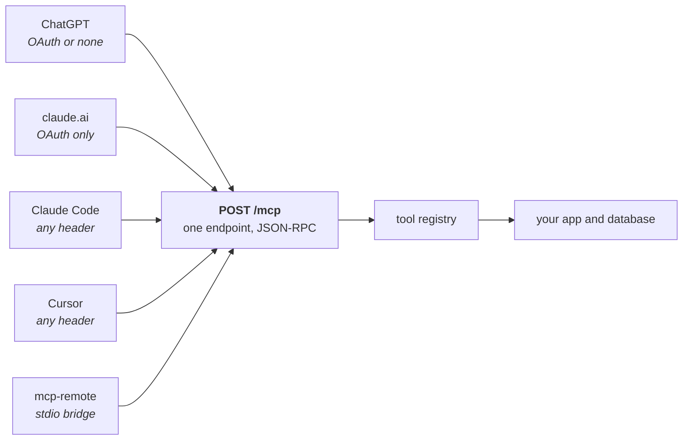
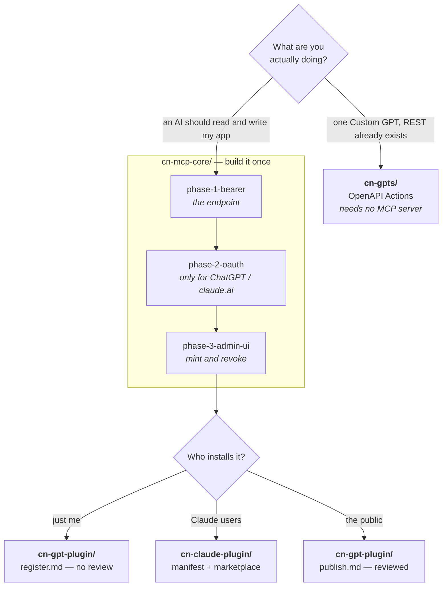

# connectors

**Scope:** the router for this repo — one paragraph of thesis, then which folder to open for your situation.
**Assumes:** you have a web app deployed on public HTTPS and you want an AI to call it. No prior MCP knowledge.

Documentation you *read*, not software you install. Point Claude Code, Codex or Cursor at this repo, let it open the one folder that matches the job, and let it write the integration into your codebase. Nothing here runs.

## The thesis

You build **one** MCP server: a single HTTPS endpoint that speaks JSON-RPC. ChatGPT, Claude.ai, Claude Code, Cursor and every other host connect to that same endpoint with the same protocol. Notion, Stripe, Linear and GitHub all ship exactly one hosted server and let every host connect to it — nobody ships a server per vendor. What differs between hosts is **how a client registers**, never what your server does. So this repo has one folder that builds the server, and vendor folders that describe registration and distribution on top of it. If you catch yourself branching server logic on which AI is calling, you have taken a wrong turn.

Every host on the left speaks the identical protocol to the identical endpoint. The italics are the *only* thing that differs between them — how a client proves who it is — and that difference is settled at registration time, never in your dispatcher.

Two things come out the far end, not one. The server, and a **copy-paste-ready setup form** — one tab per host, every value the user must move into another application sitting behind a copy button, endpoint and token alike. That form is the whole difference between a server that exists and a server anyone can connect to, so it has its own spec: [`shared/setup-form.md`](./shared/setup-form.md).

## Which folder

| Your situation | Folder |
|---|---|
| "I want an AI to read and write things in my app" — start here | [`cn-mcp-core/`](./cn-mcp-core/README.md) |
| The server exists; now get it into Claude Code, claude.ai, Desktop or Cowork | [`cn-claude-plugin/`](./cn-claude-plugin/README.md) |
| The server exists; now get it into ChatGPT, for yourself or the public directory | [`cn-gpt-plugin/`](./cn-gpt-plugin/README.md) |
| I only care about ChatGPT, I already have REST routes, one Custom GPT is enough | [`cn-gpts/`](./cn-gpts/README.md) |
| Something is broken, or I need one cross-cutting detail | [`shared/`](#shared) |

Both ChatGPT paths can coexist: Actions and MCP are two front doors onto the same routes, the same validation, the same audit log.

Stop at the first box that answers your question. Most people never reach the bottom row: a server you use yourself needs `phase-1` and `register.md` and nothing else.

Each folder's `README.md` is the orientation and the decision table; the files beside it are the deep ones you open only once you have decided:

- `cn-mcp-core/` — `phase-1-bearer.md` (the endpoint), `phase-2-oauth.md` (the authorization half), `phase-3-admin-ui.md` (token mint and revoke).
- `cn-claude-plugin/` — `manifest.md` (`plugin.json` and packaging), `marketplace.md` (`marketplace.json`, install, catalog submission).
- `cn-gpt-plugin/` — `register.md` (developer mode, no review), `publish.md` (public directory submission).
- `cn-gpts/` — `openapi-actions.md` (the schema, the auth panel, the privacy-policy gate).

## Dependencies, stated plainly

**`cn-claude-plugin/` and `cn-gpt-plugin/` assume `cn-mcp-core/` is already built and deployed.** They are packaging and registration; they change zero lines of your server. Open them with nothing built and there is nothing to package.

**`cn-gpts/` does not.** Custom GPT Actions are not MCP — a GPT calls your existing REST routes directly from an OpenAPI document you paste into GPT Builder. No JSON-RPC, no `/mcp` endpoint, no authorization server of your own if a header key is enough. It is the shortest path to one working AI client, and also the narrowest: one host, one GPT.

## shared

Eleven cross-cutting files, read alongside whichever folder you picked — tool design, per-host clients, transport, OAuth, Convex, the setup form, file and image inputs, icons, versioning, pitfalls, the security gate. The "open when" table for all of them lives in [`shared/README.md`](./shared/README.md); pull single files from there on demand.

## Reference implementation

Every concrete snippet in this repo comes from a real Next.js + Convex deployment, referred to throughout as **the worked example**. It is deliberately never named: this is a cookbook, and a recipe that only works for one restaurant is not a recipe. Its paths and snippets are quoted verbatim, so every claim here came out of running code rather than a template.

Read it honestly: it is at **Phase 1, bearer only**. Its `convex/mcp/routes.ts` says so in a header comment — *"Phase 1 = bearer only; OAuth 2.1 + PKCE is a separate, later phase"*. That makes it a working example of two things at once: a server Claude Code and Cursor can call today, and a server the ChatGPT and claude.ai connector forms will not accept, because those forms have no API-key field. It also ships a separate Custom GPT Actions surface under `GPTs/` — a different mechanism, covered in `cn-gpts/`.

Where a claim could not be confirmed from a fetched doc or from that repo, the text says `TODO: verify` inline instead of guessing. A confident wrong statement about a registration requirement costs you hours, which is the exact failure this repo exists to prevent.

## Reading this as an agent

[`AGENTS.md`](./AGENTS.md) has the full file map, per-goal reading order, and the invariants your output must not break.

## License

MIT — see [`LICENSE`](./LICENSE). Fork it, adapt it, ship it commercially.
