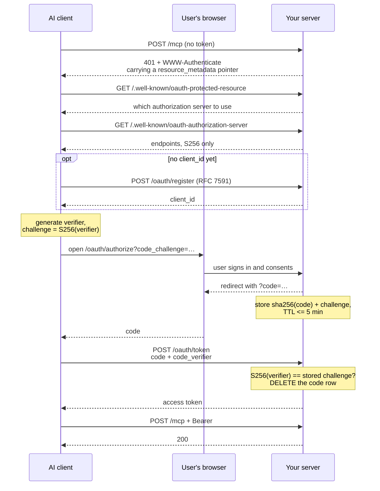

# Phase 2 — OAuth 2.1 + PKCE

**Scope:** the authorization half — consent page, auth codes, token exchange, discovery documents.
**Assumes:** Phase 1 is live and answering `initialize` over a bearer.

Full recipe in [`../shared/oauth.md`](../shared/oauth.md). The shape:



The 401 is not a failure — it is the discovery handshake starting. A client with no token is *supposed* to get one, read the `resource_metadata` pointer, and walk itself to your authorization server.

Two tables, **both storing only sha256**: auth codes (delete the row on exchange, never a `consumed` flag) and access tokens. Serve `/.well-known/oauth-protected-resource` (RFC 9728) and `/.well-known/oauth-authorization-server` (RFC 8414) — and see pitfall #12 in [`../shared/pitfalls.md`](../shared/pitfalls.md) for *where* they must live.

Nothing in the transport changes when OAuth lands. The endpoint, the dispatcher and the tool registry are identical; only the function that turns a bearer into a caller identity gains a second source.

## Worked example — deliberately absent

The worked example does **not** implement OAuth. It has no consent page and no `/.well-known/*` routes: grepping `convex/` for `well-known` and `oauth` returns exactly one hit, and that hit is the comment below. `convex/http.ts:129` mounts the transport with `registerMcpRoutes(http)`; no authorization-server routes are registered anywhere in the file. The phase boundary is stated in the transport header, `convex/mcp/routes.ts:5-6`:

```ts
// Registered by convex/http.ts. Phase 1 = bearer only; OAuth 2.1 + PKCE is a
// separate, later phase and nothing here needs to change when it lands.
```

That last clause is this page's claim, written by someone who had to live with it: when OAuth lands there, `routes.ts`, `jsonrpc.ts`, `tools.ts` and `handlers.ts` are untouched. Only `auth.ts` — the credential → caller-identity step — gains a second source.

Next: [`phase-3-admin-ui.md`](./phase-3-admin-ui.md), then [`../shared/security-checklist.md`](../shared/security-checklist.md).
