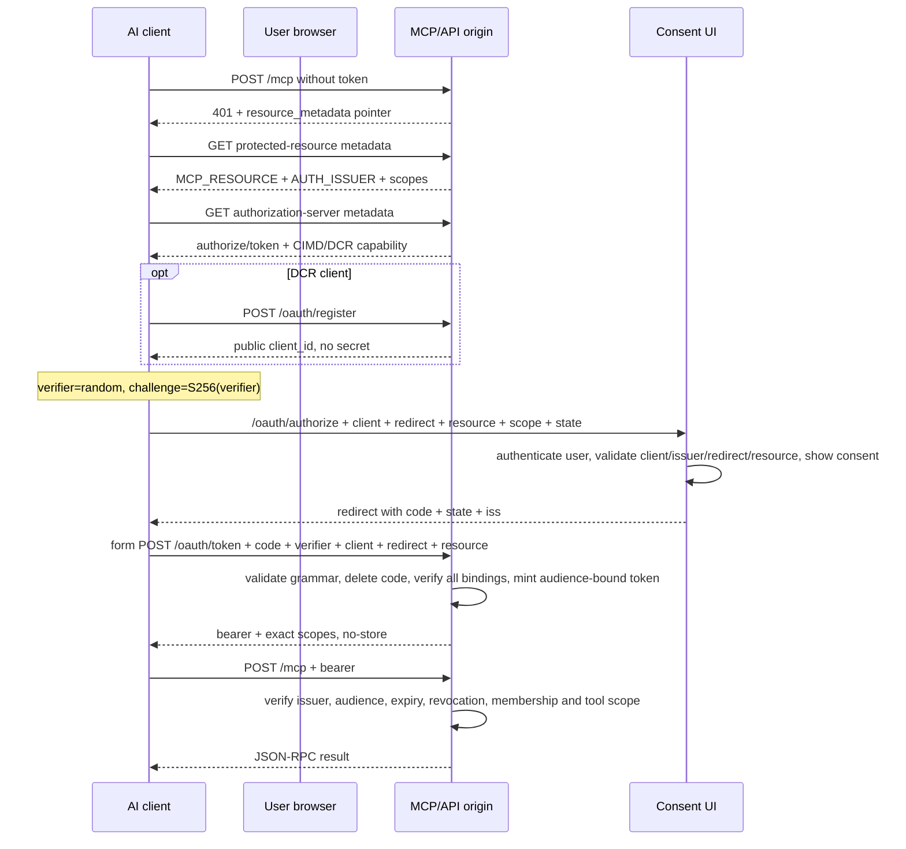

# Phase 2 — OAuth 2.1 + PKCE

**Scope:** the authorization half — protected-resource discovery, CIMD/DCR, consent, single-use codes, audience-bound tokens and rollout order.
**Assumes:** Phase 1 is live and its bearer already resolves to a server-side caller identity. The MCP dispatcher and handlers remain unchanged.

The full implementation and attack matrix are in [`../shared/oauth.md`](../shared/oauth.md). Read that file before coding; this page is the phase boundary and sequence.

## Flow



The first 401 is the handshake starting, not the end of it.

## Records

Store only digests of raw secrets:

```text
OAuth client (DCR only)
- clientId, redirectUris[], applicationType, issuer, createdAt, lastUsedAt?

Authorization code
- codeHash, challenge, clientId, redirectUri, resource, issuer, scopes, userId, expiresAt

Opaque access token
- tokenHash, userId, clientId, audience, issuer, scopes, expiresAt, revokedAt?
```

A CIMD client is validated from its HTTPS metadata document rather than minted locally.

## Load-bearing rules

- PKCE S256 only; verifier 43..128 and valid grammar.
- Exact redirect membership; never prefix matching.
- Exact canonical `resource` at authorization, exchange and every MCP call.
- Exact issuer binding for client, code and token; include/verify response `iss` when advertised.
- Token endpoint is form-encoded, not JSON.
- Code row is deleted before post-lookup validation.
- On transactional rollback systems, return a refusal after delete rather than throw, so the delete commits.
- All grant failures are one opaque `invalid_grant`; invalid audience is `invalid_target`.
- Read/write scopes are enforced per tool before handler execution.
- Tokens expire and have a user-visible revoke path.

## Nothing below auth changes

When OAuth lands, these stay the same:

```text
JSON-RPC parser
protocol-era adapter
catalog builder
input validation
policy / approval
business handlers
result normalization
redaction / audit
```

Only the credential resolver gains another source. After OAuth resolution it returns the same normalized principal Phase 1 already uses.

## Rollout order

1. Add optional client/code/token schema fields and backend validators.
2. Deploy the control plane/backend first.
3. Verify the old bearer/gateway still works.
4. Deploy discovery, consent, registration and token routes.
5. Verify one complete live OAuth flow.
6. Deploy/enforce exact audience, issuer and scopes at `/mcp`.
7. Inspect/migrate or revoke older grants before making new fields mandatory globally.
8. Register the endpoint in the target host only after discovery and live calls pass.

Deploying a new edge first can send `resource`, `issuer` or `applicationType` into an older backend that rejects those fields.

## Worked example boundary

The worked example does **not** implement Phase 2. Its transport comments explicitly describe Phase 1 bearer-only. Use it for the dispatcher boundary, not as evidence that OAuth routes/discovery already exist.

Next: [`phase-3-admin-ui.md`](./phase-3-admin-ui.md) for grant visibility/revocation, then [`../shared/testing.md`](../shared/testing.md) and [`../shared/security-checklist.md`](../shared/security-checklist.md).
