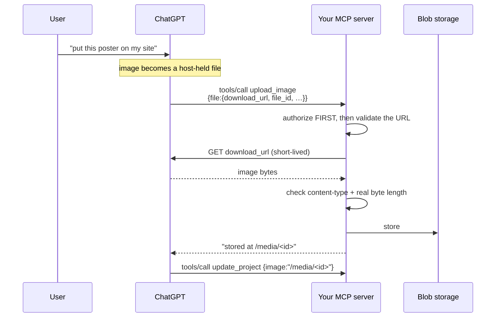
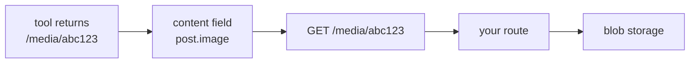

# Files and images, both directions

**Scope:** getting a file *into* a tool (ChatGPT's file-param contract, the fetch, the guards, where the bytes live) and getting an image *out* of one.
**Assumes:** a working server per [`../cn-mcp-core/`](../cn-mcp-core/README.md). Everything here is additive — a text-only server needs none of it.
**Implementation:** [`../packages/mcp-files/`](../packages/mcp-files/README.md) ships this contract as code — schema builders, the guards below, and the adapter seams. Prefer it to hand-rolling.

The use case that drives this: a user generates a poster in ChatGPT and wants it on their site. The model cannot hand you bytes — tool arguments are JSON, and no model reliably emits a megabyte of base64. So the transfer is **by reference**: the host gives you a short-lived URL and your server fetches it.

## The handoff



The server never receives the image inline. It receives a **claim** that one exists at a URL, and everything after that is your code's problem.

## Declaring a file input

List every top-level file field in `_meta["openai/fileParams"]`. Each must resolve to a file object, or an array of them.

| Property | Type | Declare | Require |
|---|---|---|---|
| `download_url` | string | yes | **yes** |
| `file_id` | string | yes | **yes** |
| `mime_type` | string | yes | no |
| `file_name` | string | yes | no |

All four declared; only the first two required; requiring either optional one is a rejection. **Scan Tools and plugin submission reject any other shape** — see [`../cn-gpt-plugin/register.md`](../cn-gpt-plugin/register.md).

```json
{
  "name": "upload_image",
  "title": "Upload image",
  "description": "Store one image after the target and purpose are known.",
  "inputSchema": {
    "type": "object",
    "properties": {
      "file": {
        "type": "object",
        "properties": {
          "download_url": { "type": "string" },
          "file_id":      { "type": "string" },
          "mime_type":    { "type": "string" },
          "file_name":    { "type": "string" }
        },
        "required": ["download_url", "file_id"],
        "additionalProperties": false
      },
      "alt": { "type": "string" }
    },
    "required": ["file"],
    "additionalProperties": false
  },
  "outputSchema": {
    "type": "object",
    "properties": {
      "ok": { "type": "boolean" },
      "mediaId": { "type": "string" },
      "url": { "type": "string" }
    },
    "required": ["ok", "mediaId", "url"],
    "additionalProperties": false
  },
  "securitySchemes": [{ "type": "oauth2", "scopes": ["mcp.write"] }],
  "annotations": {
    "readOnlyHint": false,
    "destructiveHint": false,
    "idempotentHint": false,
    "openWorldHint": true
  },
  "_meta": {
    "openai/fileParams": ["file"],
    "securitySchemes": [{ "type": "oauth2", "scopes": ["mcp.write"] }]
  }
}
```

**Inlined, not `$defs` + `$ref`.** OpenAI's published example uses `$defs`; that form is equivalent JSON Schema but it is fatal on Convex, which refuses any key starting with `$` and takes all of `tools/list` down with it — [`convex.md`](./convex.md) #11. Inlining costs nothing and works everywhere.

**This stays one host-agnostic tool.** OpenAI-specific file metadata is inert to clients that do not consume it; they still see the ordinary object schema. Keep `securitySchemes`, annotations and exact output contract aligned with [`tool-design.md`](./tool-design.md) and [`results.md`](./results.md) rather than building a second host-specific tool.

## Guards — the part that is actually yours

You just built an endpoint that makes your backend fetch a caller-supplied URL. Treat it that way.

| Guard | Why |
|---|---|
| **Authorize before fetching** | not after. An unauthenticated caller must never be able to make your backend emit an outbound request at all |
| **`https:` only** | reject `http:`, `file:`, `data:`, `gopher:` |
| **Blocklist private space** | `localhost`, `*.local`, `127.*`, `10.*`, `192.168.*`, `172.16-31.*`, `169.254.*` and `[::1]`/`fd*`/`fe80*`. `169.254.169.254` is the cloud metadata endpoint — the one that turns SSRF into credential theft |
| **Content-type allowlist** | an image tool accepts image types. Not `text/html`, not `*/*` |
| **Cap the real bytes** | check `content-length` to fail early, then check `byteLength` after reading. A lying or absent header is the normal case, not the exception |
| **Re-derive the filename** | slugify it yourself. `file_name` is attacker-controlled text heading for a filesystem or a URL |

Hostname matching cannot see DNS. A name that resolves to a private address still gets through, and a URL validated at check time can resolve differently at fetch time. Say so in a comment rather than implying the guard is total — if that gap matters to you, the fix is an egress allowlist at the network layer, not more regex.

## Where the bytes live, and the URL you hand back

Return a **stable path on your own origin** — `/media/<id>` — not the storage provider's URL.



Three reasons, all learned the hard way:

- A provider URL **rots**. Rename the deployment, change buckets, and every content row still points at the old host. A path you own is one redirect away from anywhere.
- **Same-origin images need no allowlist.** Next's `next/image` requires a `remotePatterns` entry for every external host, and a stale entry fails *silently* — see the dead-host story in [`convex.md`](./convex.md) #1.
- The id is the cache key and the bytes behind it never change, so the route can answer `Cache-Control: public, max-age=31536000, immutable` and be fetched once ever.

Serve with the stored MIME type and `X-Content-Type-Options: nosniff`. A malformed id is a **404, not a 500** — a bad document id thrown by your database is still just a visitor typing nonsense.

## Sending an image back

The other direction is inline and needs no URL. MCP defines `ImageContent`:

```json
{ "type": "image", "data": "<base64>", "mimeType": "image/png" }
```

Return it in `content` exactly like a text block. Keep it small — this rides in the JSON-RPC response and lands in the model's context, so a full-resolution render is a token bill, not a feature. Return a link for anything a human is meant to look at, and reserve inline images for what the *model* must actually see: a chart it should read, a diff it should compare.

Icons are a separate mechanism again — declared, not returned. See [`icons.md`](./icons.md).

## Checklist

- [ ] All four file properties declared; exactly `download_url` and `file_id` required
- [ ] No `$`-prefixed key anywhere in the descriptor
- [ ] Authorization runs before the fetch
- [ ] https-only, private-space blocklist, content-type allowlist, byte cap on the real length
- [ ] Filename re-derived server-side
- [ ] Returned path is on your origin, immutable-cacheable, 404 on a bad id
- [ ] The tool's reply says what to do next — the path *and* which field to put it in

That last one is not decoration. The model's next move is writing this path into a content field; a bare JSON blob makes it guess the field name. See [`tool-design.md`](./tool-design.md).
